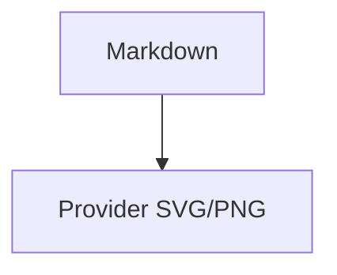
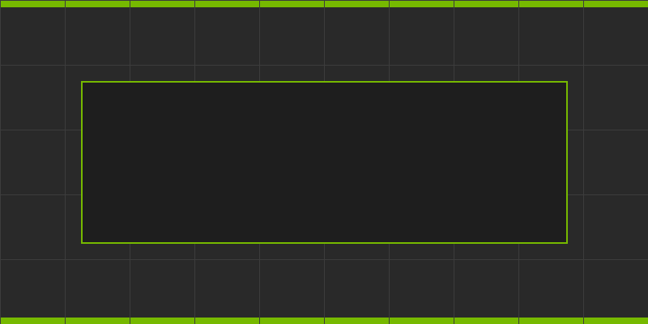

# MarkdownWidget Feature Review

This document focuses on the new implementation surface: rich table cells,
provider-backed HTTP images, optional SVG resolution, granular style groups,
font face quality, heading anchors, alerts, and the code-block copy button.

## Rich Inline Table Cells

| Cell type | Render target | Current result |
|:---|:---|---:|
| Emphasis | **bold**, *italic*, ~~strike~~, and `inline code` inside one cell | Styled |
| Link | [clickable table link](https://example.com/table-rich-link) in a wrapped cell with more text | Clickable |
| Local image | icon in table cell:  | Rendered |
| HTTP image | cached provider badge:  | Rendered |
| SVG image | optional SVG rasterization:  | Rasterized |

The link row intentionally wraps so hover/click hit testing can be checked
inside a table, not only in regular paragraphs.

The showcase table uses `layout_policy: content-fit` so the wider content
column gets more room without changing the default equal-width policy.

## Heading Anchors And Alerts

### Repeatable Heading

### Repeatable Heading

The anchor mark after each heading should call back with stable
`#repeatable-heading` and `#repeatable-heading-1` fragments.

> [!NOTE]
> Marker lines should be hidden while preserving normal inline formatting like
> **bold**, *emphasis*, and `code`.

> [!TIP]
> Alert colors are separately themeable with `MarkdownWidget.Alert.*` style groups.

> [!IMPORTANT]
> Important alerts use a distinct accent from links and normal quote bars.

> [!WARNING]
> Warnings remain legible in the white and dark-blue showcase themes.

> [!CAUTION]
> Cautions should be visually distinct from warnings.

## Code Copy

The code block below should show a compact copy affordance in the top-right
corner. Clicking it copies only the code block text.

```python
def render_markdown(source: str) -> None:
    widget = ui.MarkdownWidget(source)
    widget.set_link_clicked_fn(lambda url: print(url))
    widget.set_image_url_provider_fn(resolve_image_src)
```

## Syntax Highlighting

Known languages use the native deterministic fallback. Unknown languages keep
the existing single-color code-block path.

```cpp
int main() {
    const int answer = 42;
    // comment token
    return answer;
}
```

```json
{"enabled": true, "threshold": 0.75, "name": "markdown"}
```

```bash
echo "render"
if test -f build/ovui.so; then
    printf "%s\n" "ok" # shell comment
fi
```



## Images

Local raster image:



HTTP/S images are resolved through a provider-backed cache. The showcase starts
a local HTTP server and downloads this HTTP badge into `~/.cache/ovui-markdown-images/`.


SVG support is intentionally provider-owned for now. If `cairosvg` is installed,
the provider rasterizes the SVG to a cached PNG; otherwise the widget shows its
normal compact image placeholder.


Mermaid is not parsed natively. A `mermaid` code fence renders as code; a
separate preprocessor can turn Mermaid output into an SVG/PNG image and feed it
through the same image-provider path.

## Font And Glyph Quality

Bold and headings should use a real bold face when one is available. Emphasis
should use a real italic face when available. Fallback text should improve
coverage for arrows and symbols without changing ImGui itself:

Regular text, **bold text**, *italic text*, `monospace code`, arrows ← ↑ → ↓,
math-ish symbols ± × ÷, and emoji 😀 🚀 ✅.

## Granular Style Keys

This showcase applies separate style groups for links, inline code, code
blocks, copy button, tables, image placeholders, and heading levels. The goal
is to move away from one broad secondary color and toward full Markdown theming.
