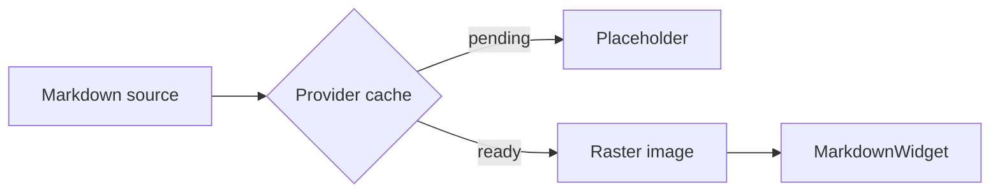

# Provider Plugin Showcase

This file exercises optional provider plugins. HTTP/S and SVG flow through the
image resolver. Mermaid and math fences flow through the provider document
renderer and become image Markdown when ready.

## SVG Image


## Mermaid Fence



## Math Fence

```math
E = mc^2 \qquad \int_0^1 x^2\,dx = \frac{1}{3}
```

## Fallback Code

```python
def still_code(value: int) -> int:
    return value + 1
```
